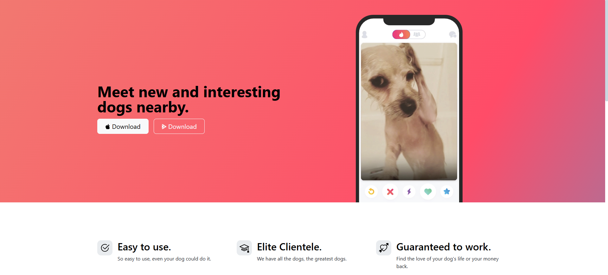
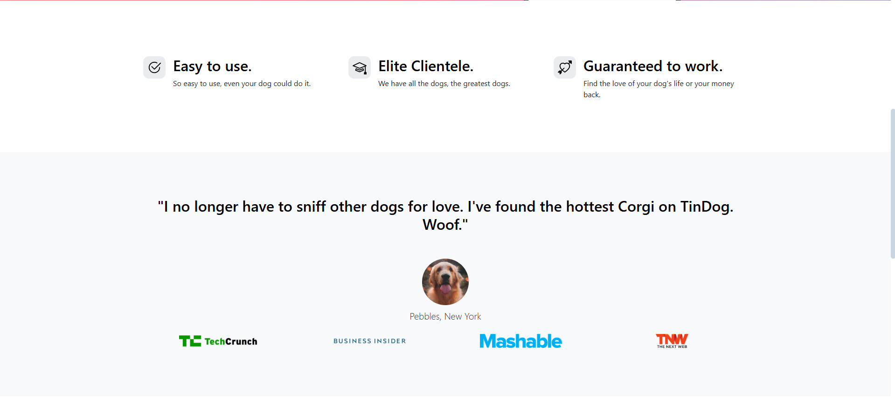

# TinDog-Landing-page
A responsive landing page for TinDog — a fictional dog dating app, built with HTML, CSS, and Bootstrap.
# TinDog 🐶📱

A responsive landing page for TinDog — a fictional dog dating app, built with HTML, CSS, and Bootstrap.

## Features

- Fully responsive design using **Bootstrap 5**
- Clean and modern UI
- App mockups and media logos for branding
- Download buttons styled for iOS and Android

## Technologies Used

- HTML5
- CSS3
- Bootstrap 5

## How to Use

1. Clone or download this repository.
2. Open `index.html` in your browser to view the page.
3. Customize text, styles, or images as needed.

## Screenshots

## License

This project is for educational and personal portfolio use only.
